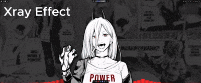

# <p align="center">cava-bg - Native CAVA Visualizer for Wayland</p>

<p align="center">
  
</p>

<p align="center">
  
  
  
  <a href="https://discord.gg/ehQYYW36Up">
    
  </a>
</p>

**cava-bg** is a modern, lightweight, and highly customizable visualizer that turns any Wayland desktop into a dynamic audio experience. Designed for users who want seamless wallpaper integration without sacrificing performance, it features real-time color adaptation to your wallpaper and a unique multi-layer parallax and "hidden image" reveal mode, making it the perfect choice for stylized desktop setups.


## Features

- **Native Wayland + wgpu rendering** – GPU‑accelerated visuals with low latency
- **Adaptive colors** – Extracts a gradient palette from your current wallpaper
- **Real‑time wallpaper monitoring** – Automatically updates colors when you change your wallpaper (supports awww, mpvpaper, waypaper, swaybg, swww, hyprpaper, wpaperd, etc.)
- **Full configuration** – TOML config file with options for bar count, gap, smoothing, framerate, and more
- **Static color fallback** – Use manually defined colors if dynamic extraction is disabled
- **Lightweight** – Spawns a single `cava` process and renders at your specified framerate
- **Multi‑output support** – Works on multiple monitors; can target a specific output
- **Kill command** – `cava-bg kill` stops any running instance
- **Animated Hidden Images & Video Wallpapers** - Support for video files (mp4, webm, etc.) for hidden layer reveals via ffmpeg-next.
- **Parallax System** - Add depth to your desktop environment with mouse-reactive and audio-reactive layers.
- **Advanced X-Ray system** - Seamlessly animate image masks reacting to audio.
- **Daemon Mode** - Easy background running via `cava-bg on` and `cava-bg off`.
- **GUI Configuration** - Full visual editor with color previews and tabbed organization (`cava-bg gui`).
- **Hot Reloading** - Configuration changes are applied without restarting the daemon.
- **Performance Optimization** - Idle mode, lazy video decoding, and FPS limiting.

### Static Color Mode (Fallback or Manual)
If `dynamic_colors = false`, the visualizer uses user-defined colors from the `[colors]` section of the configuration file. Each color can be defined as a simple hex string (`"#rrggbb"`) or as an object containing both hex and alpha values.

### Flexible TOML Configuration
- **Default file path:** `~/.config/cava-bg/config.toml`
- **Key options include:**
    - `framerate`: Frames per second.
    - `bar_count`: Total number of vertical bars.
    - `gap`: Spacing between bars (as a fraction of bar width).
    - `bar_alpha`: Transparency level for the bars.
    - `corner_radius`: Corner rounding for the window (useful if the background isn't fully transparent).
    - `height_scale`: Allows bars to stay within a fraction of screen height.
    - `autosens` / `sensitivity`: CAVA sensitivity controls.
    - `preferred_outputs`: List of target monitor names (e.g. `["DP-1", "HDMI-A-1"]`).
    - `background_color`: Background color for the overlay layer (fully transparent by default).

[Example Simple.webm](https://github.com/user-attachments/assets/4bb512ac-20aa-481f-be9f-94050b2d798a)

### Advanced Hidden Image / X-Ray System
Displays a fixed or animated layer that is "revealed" by the bars as they move up and down.
- **Image/Video Effects:** Apply transformations or react to the audio directly. Video support allows animated reveals over static wallpapers.
- **Advanced Features:** You can use your current wallpaper as the hidden image or enable an automatic "x-ray" search in a specific directory to find stylized versions of your wallpaper (`basename.*` and `basename_reveal.*`) for special visual effects, for both x-rays and parallax layers.

<p align="center">
  
</p>

### Multi-layer Parallax System
Create a 3D depth effect by moving independent layers at different speeds.
- **Modes:** `AudioReactive`, `MouseReactive`, `Animated` (independent), and `Hybrid`.
- **Profiles:** Save and load complete sets of layers as profiles (toml). Automatic selection based on wallpaper name.
- **Per-layer Configuration:** Z-depth, opacity, blend mode, parallax speed, offset, mouse reaction (sensitivity, max offset), audio reaction (frequency zone, response curve, transforms: shift, scale, rotate), standalone animation (`Float`, `Rotate`, `Scale`, `Pulse`, `Wiggle`), and drop shadow.
- **Performance:** Lazy loading of assets, pausing on idle mode, disabling under high load.

<p align="center">
  
</p>

### GUI Configuration Interface
Launch the visual editor with `cava-bg gui`. The GUI organizes all options into tabs:
- **Audio:** Audio source, sensitivity, complete audio disabling.
- **Visualizer:** Display mode (Bars, Mirrored Bars, Inverted Bars, Blocks, Waveform, Spectrum, Ring), bar shape (Rectangle, Circle, Triangle, Line), dimensions, spacing, height, and mode-specific options.
- **Effects:** Bar smoothing, advanced CAVA filters (Monstercat, waves).
- **Colors:** Palette editor (multiple colors with picker), gradient direction, automatic extraction from wallpaper, bar opacity.
- **X-Ray:** Activation, image source (specific file or name-matched directory), color effects (grayscale, invert, sepia), blend mode.
- **Parallax:** Global settings (mode, 3D depth, mouse tracking), profile management (create, load, save, delete), layer order, individual layer properties.
- **Performance:** VSync, multi-threaded decoding, idle mode (audio threshold, timeout, idle FPS, exit transition), video decoder settings (lazy init, auto shutdown, pause on idle), X-Ray texture optimization (prescale, mipmaps, mask compute mode), telemetry.
- **Advanced:** Verbose logging, target output (runtime detected list, output overrides), preset management (save, load, import/export).

The GUI also includes daemon control (start, stop, restart) and auto-saving with hot-reloading when changes are made.

### Performance Optimization (Idle Mode)
The visualizer can save resources when no audio is playing:
- **Detection:** Lowers the FPS and pauses video decoding processes if audio levels drop below a threshold for a set amount of time.
- **Transitions:** Smoothly restores performance when audio is detected again (configurable exit/enter duration).

## Installation

### Arch Linux (AUR)
#### Using yay
```bash
yay -S cava-bg
```
#### Using paru
```bash
paru -S cava-bg
```

### Dependencies
Before installing from source or pre-built packages, ensure you have the following dependencies:
- **cava**
- **wayland**
- **ffmpeg** (for video background support)
- Rust toolchain (if building from source)
### Debian/Ubuntu (DEB packages)

Download the `.deb` package from the releases section and install it with:

```bash
sudo dpkg -i cava-bg_<version>_amd64.deb
sudo apt-get install -f  # To fix dependencies if needed
```
### Fedora (RPM packages)

Download the `.rpm` package from the releases section and install it with:

```bash
sudo rpm -i cava-bg-<version>.rpm
```
#### or using dnf
```bash
sudo dnf install cava-bg-<version>.rpm
```

### From Source

1. **Install Dependencies:**
```bash
# Arch Linux
sudo pacman -S cava rustup wayland wayland-protocols libxkbcommon mesa libglvnd ffmpeg
```
```bash
# Debian/Ubuntu
sudo apt install cava rustc cargo libwayland-dev wayland-protocols libxkbcommon-dev libgl1-mesa-dev libglvnd-dev libavformat-dev libavcodec-dev libavutil-dev libavfilter-dev libswscale-dev libswresample-dev
```
```bash
# Fedora
sudo dnf install cava rust cargo wayland-devel wayland-protocols-devel libxkbcommon-devel mesa-libGL-devel libglvnd-devel ffmpeg-devel
```

2. **Build and Install:**
```bash
git clone https://github.com/leriart/cava-bg.git
cd cava-bg
cargo build --release
sudo cp target/release/cava-bg /usr/local/bin/
```

3. **Test Installation:**
```bash
# Run cava-bg
cava-bg on
```

## Usage
```bash
# Start in the background as a daemon
cava-bg on

# Run in the foreground with a custom config
cava-bg on --config /path/to/config.toml

# Run in foreground with debugging logs
cava-bg on --debug

# Stop the background daemon
cava-bg off # or cava-bg kill

# List output monitors
cava-bg outputs

# Turn visualizer on a specific output monitor
cava-bg output-on --output DP-1
```

## Configuration

cava-bg uses a flexible TOML configuration file. The default configuration is created at `~/.config/cava-bg/config.toml`. 

- **Key options include:**
    - `framerate`: Render frames per second (general.framerate).
    - `bar_count`: Total number of vertical bars (audio.bar_count).
    - `gap`: Spacing between bars as a fraction (audio.gap).
    - `bar_alpha`: Transparency level for the bars (audio.bar_alpha).
    - `corner_radius`: Corner rounding for the wayland window (general.corner_radius).
    - `height_scale`: Allows bars to stay within a fraction of screen height (audio.height_scale).
    - `autosens` / `sensitivity`: CAVA sensitivity controls (general.autosens).
    - `dynamic_colors`: Extract colors from wallpaper automatically (general.dynamic_colors).
    - `vsync`: VSync configuration (performance.vsync).

For custom and fallback color palettes, see the `[colors]` block.

## How It Works

- **Wallpaper detection** – Automatically monitors tools like awww, mpvpaper, hyprpaper, swaybg, swww, waypaper, and more.
- **Color extraction** – Using color_thief, it extracts a palette of dominant colors from your background, smoothly transitioning when the background changes.
- **Parallax System** - Reacts to global mouse movements across output monitors or audio frequencies to shift layered images independently.
- **CAVA integration** – Spawns an internal cava process reading raw 16-bit output.
- **Wayland layer shell** – Uses the wlr_layer_shell protocol via smithay-client-toolkit to draw a transparent background window seamlessly.
- **wgpu rendering** – High-performance shader rendering.
- **Video Decoding** - Built-in fast software video decoding via `ffmpeg-next` allows multi-threaded playback of mp4 and other animated sources.

## Supported Wallpaper Tools & Managers
- awww
- mpvpaper
- hyprpaper
- swaybg
- wpaperd
- waypaper
- waytrogen
- hpaper
- walt
- wlsbg
- wallrizz
- Any Qt Multimedia based wallpaper engine

## Hyprland Shells/Dotfiles
- ambxst
- quickshell
- qmlscene

## Desktop Environments
- GNOME (Wayland)
- KDE Plasma (Wayland)
- Cinnamon (Wayland)
- Budgie (Wayland)
- XFCE (Wayland)
- MATE (Wayland)
- LXQt (Wayland)
- Deepin (Wayland)
- Enlightenment (Wayland)

## Acknowledgments

### Projects & Libraries
- **wallpaper-cava** - Inspiration and audio processing approach
- **CAVA** - Audio visualization engine
- **Smithay Client Toolkit** - Wayland client library
- **wgpu** - Modern graphics API for Rust
